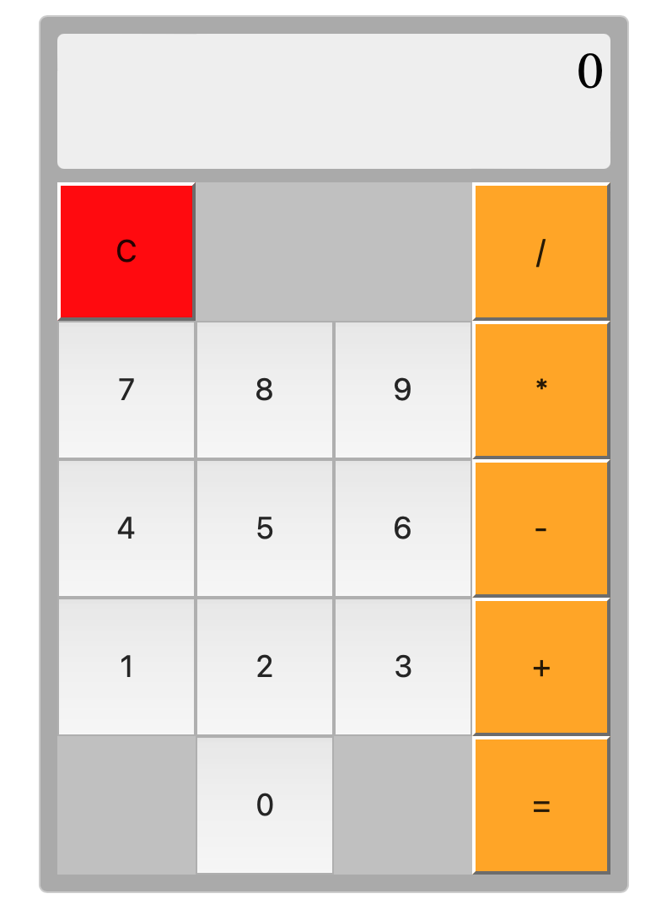

# Calculator App

A basic calculator web application built with React. This calculator allows users to perform arithmetic operations such as addition, subtraction, multiplication, and division. It also includes features like percentage calculation and the ability to clear or delete the last entry.

## Technologies Used
- JavaScript
- HTML
- CSS

## Usage

1. Clone the repository: `git clone https://github.com/AbdulkarimMziya/Calculator.git`
2. Navigate to the project folder: `cd calculator`
3. Open VS Code: `code .`
4. Open onto browser `open index.html` or `open -a "Google Chrome" index.html`

Feel free to contribute and improve the calculator app. If you encounter any issues or have suggestions, please open an issue.

## Images

